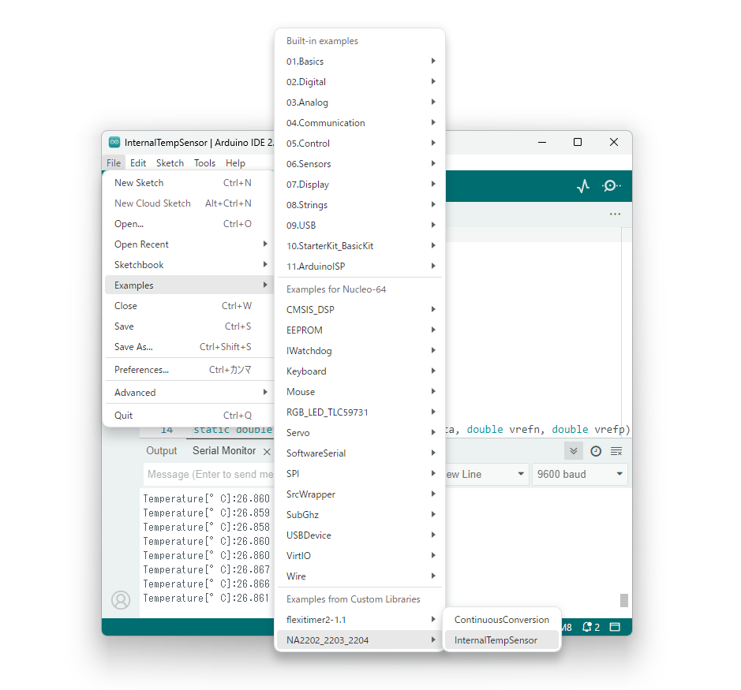

# NA2202_2203_2204_Arduino_library

Arduino library for NA2202/2203/2204

### Product pages

- 16Bit Analog to Digital Converter [NA2202](https://www.nisshinbo-microdevices.co.jp/en/products/afe/spec/?product=na2202)
- 20Bit Analog to Digital Converter [NA2203](https://www.nisshinbo-microdevices.co.jp/en/products/afe/spec/?product=na2203)
- 24Bit Analog to Digital Converter [NA2204](https://www.nisshinbo-microdevices.co.jp/en/products/afe/spec/?product=na2204)

## Requirements

### In the case of using STM32 Nucleo-64

Additionally STM32duino is required.  
See also [STM32duino Getting Started](https://github.com/stm32duino/Arduino_Core_STM32/wiki/Getting-Started)

## Installation

1. Download a zip archive from [Release Page](https://github.com/nisshinbo-microdevices/NA2202_2203_2204_Arduino_library/releases)
2. Install to Arduino as library from the zip archive.  
   See also [Installing Additional Arduino Libraries](https://www.arduino.cc/en/Guide/Libraries)

## Library Reference

[Document](https://nisshinbo-microdevices.github.io/NA2202_2203_2204_Arduino_library/)

## Examples

After installing the library, example scketches will be found in:  
`File -> Examples -> NA2202_2203_2204 -> `

